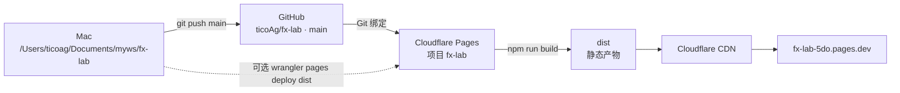

# 部署架构

fx-lab 是纯静态 SPA。没有应用服务器，没有数据库。
本机 Mac 只做控制面：写代码、推 GitHub、改 Pages 控制台配置。
GitHub `main` 是生产分支，Cloudflare Pages 拉源码、跑构建、把 dist 发到边缘。

线上：https://fx-lab-5do.pages.dev/
仓库：https://github.com/ticoAg/fx-lab
Pages 项目：fx-lab
本机路径：/Users/ticoag/Documents/myws/fx-lab

## 链路



## 分工

| 角色 | 归属 | 做什么 |
| --- | --- | --- |
| 开发 | Mac 本机 | 改代码、本地 dev、push |
| 源码 | GitHub ticoAg/fx-lab | 公开仓库，生产分支 main |
| CI | Cloudflare Pages 构建 | 克隆 main，Node 20，`npm run build` |
| 托管 | Cloudflare Pages 项目 fx-lab | 存放并发布 dist |
| 边缘 | Cloudflare CDN | 分发 fx-lab-5do.pages.dev |

首次上线走的是 Wrangler Direct Upload，现在控制台已绑定 Git。Wrangler CLI 不能绑定 Git 源。

## 配置放哪

| 配置 | 位置 | 值 |
| --- | --- | --- |
| 构建命令 | Pages 控制台 Build configuration | `npm run build` |
| 构建输出目录 | Pages 控制台 | `dist` |
| 根目录 | Pages 控制台 | 留空（仓库根） |
| 框架预设 | Pages 控制台 | Vite；上面两项填了也可选 none |
| 生产分支 / 自动部署 | Pages 控制台 | main，自动部署开 |
| 构建系统版本 | Pages 控制台 | Version 3 |
| 项目名 / 产物目录声明 | wrangler.toml | `name = "fx-lab"`，`pages_build_output_dir = "./dist"` |
| Node 版本 | .nvmrc | `20` |
| SPA 回退 | public/_redirects | `/* /index.html 200` |
| 本地 dev 端口、`assetsInclude` | vite.config.ts | 本地与构建配置，不是 Pages 设置 |

构建命令只在控制台。wrangler.toml 里不写构建命令。

wrangler.toml 必须保持：

```
name = "fx-lab"
compatibility_date = "2026-08-23"
pages_build_output_dir = "./dist"
```

package.json 的 `build` 脚本是 `tsc -b && vite build`，控制台里填的 `npm run build` 就是它。

## 发布流程

1. 本机 `git push` 到 `main`。
2. Pages 克隆仓库 main。
3. 按 .nvmrc 用 Node 20。
4. 跑 `npm run build`，产出 dist。
5. 上传 dist，发到 CDN，fx-lab-5do.pages.dev 生效。

dist/ 和 node_modules/ 都在 .gitignore 里，由 Pages 构建生成。
本文撰写时最后一次成功的 Git 部署是提交 `8204db3`，即删掉不支持的 `[build]` 键那次。

## 可选：绕过 Git 直传

本地构建后直传，不影响已有的 Git 绑定。

```
npm run build
npx wrangler pages deploy dist --project-name fx-lab
```

## 坑

- wrangler.toml 里绝不要加 `[build]` 表。那是 Workers 专用键，Pages 会拒绝，Git 构建几秒内失败。
- 控制台的构建命令和输出目录不要留空，否则构建不出 dist。
- 框架预设别选 CRA，选 Vite 或 none。
- 别把 dist 提交进仓库。
- `wrangler pages download config --force` 会用控制台的值覆盖本地 toml；控制台当时为空就会把本地写空。

## 本地命令

```
npm install
npm run dev      # 127.0.0.1:5173，端口在 vite.config.ts 里固定
npm run build
npm run preview
```
